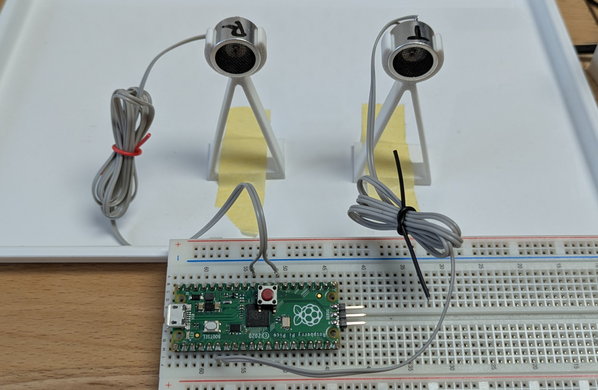
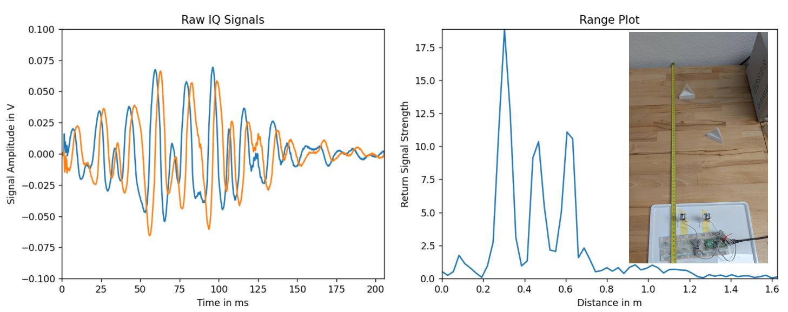

# Raspberry Pi Pico FMCW Ultrasonic Rangefinder

Ultrasonic distance measurement using only two 40 kHz transducers and a Raspberry Pi Pico, with no additional analog circuitry.  
This repository contains the firmware, chirp-generation scripts, and Python tools used for capturing and processing FMCW ultrasonic data.

For a full explanation of the theory, implementation, and signal processing details, see the accompanying blog post: https://martin.pittermann.eu/posts/2025-11-14-rp-pico-ultrasonic-sensor/



## Overview

This project demonstrates how a Raspberry Pi Pico can act as a complete **FMCW (Frequency-Modulated Continuous Wave)** ultrasonic ranging system using:

- One ultrasonic **transmitter transducer**
- One ultrasonic **receiver transducer**
- No op-amps, no filters, no mixers, no drivers
- Just firmware, aliasing tricks, and the RP2040’s PIO

Instead of generating a short ultrasonic pulse (like the HC-SR04), the Pico outputs a **chirp** at 40 kHz using its PIO and DMA.  
The incoming echo is then sampled in sync with the transmitted signal so that aliasing produces a usable **intermediate frequency (IF)** without any analog mixer.

A Python script receives the raw I/Q samples, performs an FFT, and reveals a full **range profile** rather than just a single “echo time.”

Below is an example of the resolved range peaks in a corner-reflector scene:



## Features

- FMCW chirp generation on the Pico using PIO and DMA  
- Synchronized ADC sampling producing I/Q data  
- Purely digital mixing via sampling aliasing  
- USB streaming of raw samples  
- Python post-processing and FFT-based range extraction  
- No analog circuitry beyond the transducers themselves  

## Hardware Setup

You will need:

- Raspberry Pi Pico  
- Two 40 kHz ultrasonic transducers (TX and RX)  
- USB cable  

Wiring:

- **Transmitter**: between **GPIO 4** and **GPIO 5** (differential drive)  
- **Receiver**: one pin to **ADC_0**, the other to **GND**

That's all. No biasing network is required for the receiver, and no driver stage is required for the transmitter.

## Building and Flashing

Clone the repo and ensure your Pico SDK path is correctly set.

```bash
cmake -B build . -G Ninja "-DPICO_SDK_PATH=$HOME/pico-sdk/"

cmake --build build
# or simply:
./flash.sh
```

## Processing the Data

After flashing, the Pico streams I/Q samples via USB serial.

Use:

```bash
python3 src/read_data.py
```

This script:

- Reads raw I/Q sample streams  
- Reconstructs complex samples  
- Performs an FFT  
- Outputs a range profile  
